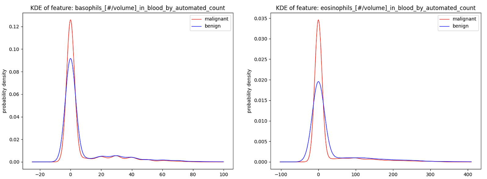
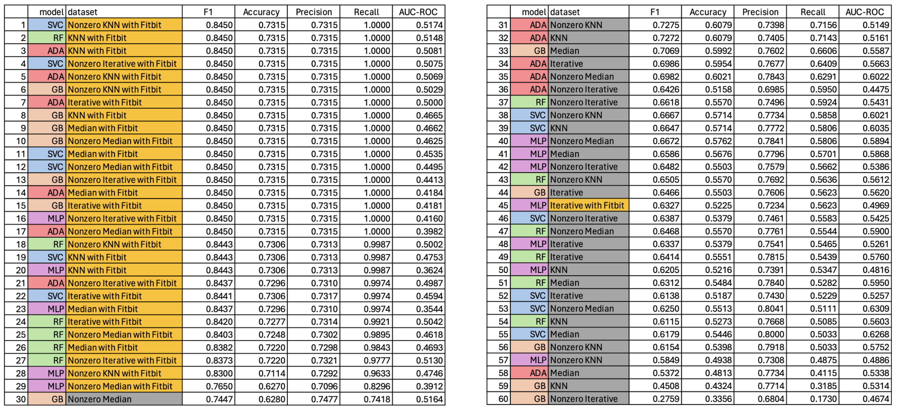
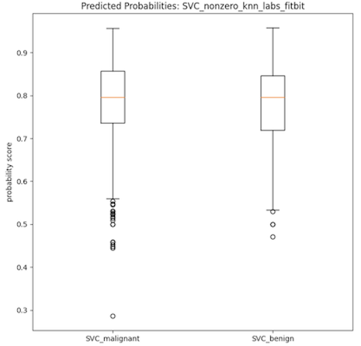
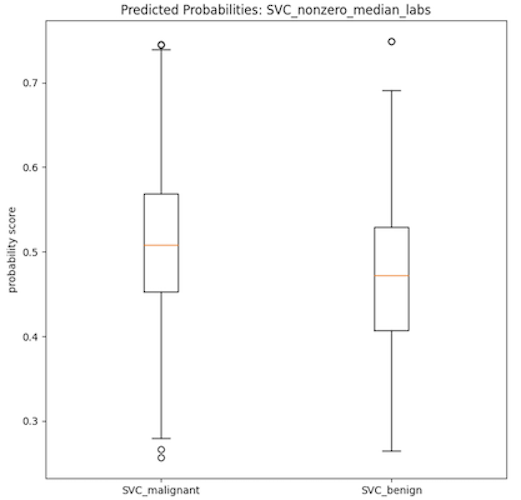

<h3>Purpose and Overview</h3>

  <figure class="figure w-20 float-end m-2">
    
  </figure>
  
This project was my Honors undergraduate thesis at the University of Hawai’i at Mānoa, in which I used Python to prepare and analyze publicly available breast cancer patient data to train machine learning (ML) models to predict the malignancy of these patients. The data was sourced using the All of Us program, a program organized by the (United States) National Institute of Health which serves to aggregate, anonymize, and make available patient health data for research projects. This project can be separated into three major stages: data cleaning and preparation, exploratory data analysis, and model training and evaluation. The machine learning model types used in this study were imported from the sklearn library and include: multilayer perceptron, support vector machine classifier, random forest, Adaboost classifier, and gradient boosting classifier. Please note that this webpage serves to summarize the main points of the project; for a more detailed description of background research, methodology, and results the full project write-up is linked at the bottom of the page. Lastly, I want to especially thank my primary mentor, Dr. Peter Washington, and my committee member, Dr. Mahdi Belcaid, for providing their scholarly insight and support during this project.

<h3>Specific Aims</h3>
- This project had two main goals:
  - To successfully train a good ML classification model. The criteria of success was an AUC-ROC score of 0.85 or higher
  - To compare the performance difference between ML models trained on two different types of datasets. The first type would have a comparatively larger number of observations but smaller number of features, while the second type would have the opposite (smaller number of observations but more features). For future reference, datasets in the first type will be referred to as **original-type**, while datasets in the second type will be referred to as **Fitbit-type** since Fitbit data was used to construct them.

<h3>Dataset Source</h3>
- For this project, I used anonymized patient data available via the All of Us Program. More specifically, this project uses the All of Us Registered Tier Dataset v7. Quantitative cardiovascular health and liquid biopsy data from both benign and malignant patients was used to construct the bulk of the training dataset. Due to the large number of entries, data was aggregated on a per-patient/per-year basis. For example, if patient 001 has entries in the years 2000, 2001, 2003, and 2006, they would have four separate entries. This stage was the construction of the raw **original-type** dataset.
- Additionally, Fitbit data was merged onto applicable rows in the **original-type** datasets. Applicable Fitbit data used in the study included: sleep, heart rate, activity-minutes, and caloric usage data. This stage was the construction of the raw **Fitbit-type** dataset. Since the relevant Fitbit data available was much smaller in volume compared to the cardiovascular and liquid biopsy data, the raw **Fitbit-type** dataset was approximately one-fifth the size of the raw **original-type** dataset.

<h3>Data Cleaning and Preparation</h3>
- After sourcing the raw data for the **original-type** and **Fitbit-type** datasets, the next step was data cleaning and preparation. This process was performed on both datasets and included transposing rows/columns, type validation and/or coercion, removal of irrelevant data (such as metadata in each row), and dummy variable creation when needed. As many rows of data had missing/null values, imputation was necessary. Three different imputer models were imported from the sklearn library and used for this task. The sklearn imputer models used included: SimpleImputer, KNNImputer, and IterativeImputer. Additionally each imputer model was used twice, first with imputing only missing/null values and the second with interpreting zero values as null. After imputation, there were 12 different training datasets, 6 of either the **original-type** or the **Fitbit-type**.
- Additionally, a small portion of the data that contained cardiovascular health, liquid biopsy, and Fitbit data was extracted and used to construct a validation dataset for model evaluation later in the project. As the validation dataset contained null/missing values as well, imputation was performed on the validation dataset separately but using the same imputation method as the training dataset for any specific model. For example, if a ML model was trained on an **original-type** dataset with KNN imputation, then the validation dataset would be filtered to contain only cardiovascular health and liquid biopsy data and undergo KNN imputation.

<h3>Exploratory Data Analysis</h3>

  <figure class="figure w-40 float-start m-2">
    
  </figure>

The primary method of exploratory data analysis was the usage of kernel density estimation (KDE) plots to estimate the general distribution of each data feature. KDE plots were plotted for each feature/column in both the **original-type** and **Fitbit-type** datasets. While some features, such as *eosinophil counts* and *basophil counts* from the selected liquid biopsy data, showed high separation in the distribution of benign and malignant patient data, a large number of other features displayed high similarity between both benign and malignant patient data. This is a trait which foreshadowed the inconclusive findings after model evaluation.

<h3>Model Training and Evaluation</h3>
- The five *sklearn* machine learning classifier models used in this project included: multilayer perceptron (MLP), support vector machine classifier (SVC), random forest (RF), adaboost (Ada), and gradient boosting machine (GB). Each of these five models were trained on each of the twelve different datasets (six of the **original-type** and six of the **Fitbit-type**) resulting in 60 total models trained. The classifications metrics derived from evaluating the model performance on the unseen validation dataset are detailed below. Models trained on **Fitbit-type** datasets have names colored in gold, models trained on **original-type** datasets have names colored in gray. Likewise, model type is color-coded as violet, blue, green, red, and orange according to MLP, SVC, RF, Ada, and GB model respectively. Classification metrics evaluated were accuracy, precision, recall, F1 score, and AUC-ROC score.

  <figure class="figure w-40 float-start m-2">
    
  </figure>

 
 
 
 
 
 
 
 
 
 
 
 
 
 
 
 
 
 
- As can be seen in the data table provided, all of the 60 trained models had low AUC-ROC scores which is indicative of poorly performing classification models. Additionally, the boxplots provided below show two distributions of the probability scores of the SVC models used in the calculation of the AUC-ROC score. Both plots show very little separation between the benign and malignant class, which is indicative of the low discerning power of the model type and partly explains the low AUC-ROC scores. It is important to note that the SVC models on average had the most separation between the beningn and malignant classes, when viewed using these boxplots as evaluation. It then stands to infer that the other models (RF, MLP, Ada, GB) have more highly similar distributions between the binary classes, indicative of even worse classification power of the corresponding models.

  <figure class="figure w-40 float-start m-2">
   
  </figure>
  <figure class="figure w-40 float-end m-2">
    
  </figure>

 
 
 
 
 
 
 
 
 
 
 
 
 
 
 
 
 
 
 
 
 
- However, it is interesting to note that models trained on the more complex **Fitbit-type** datasets have high recall. This effect could then be leveraged to use these models, or modifications thereof, to be used as screening tools rather than as diagnostic tools. Of course, there is also the possibility that these high recall scores are indicative of overfitting, which is a problem that should be looked at in any future iterations of this project.

<h3>Conclusions and Personal Takeaways</h3>
- While I currently do not have any plans to continue this project, it was undoubtedly an excellent learning experience in all of the most common stages of a data science project. This project helped me exercise my learning in how to properly clean and prepare data, basic exploratory data analysis, and how to subjectively evaluate ML models and their potential applications.
- On a more personal note, this project was a daunting experience for me as an inexperienced undergraduate student. Through this experience, I learned that I personally enjoyed the data wrangling part of the project the most out of all three stages (data wrangling, EDA, and model training/evaluation). This information helped me decide on what kind of jobs I would be primarily looking for, and also what kind of future personal projects I might pursue. While tangentially related, this experience has also made me interested in learning about database administration and its applications.

<h3>Links</h3>
- View the <a href="../documents/DY_JEREMIAH_SENIORPROJECT.pdf">full project report</a>.
- Visit the <a href="https://allofus.nih.gov/">All of Us Research Program homepage</a>.
