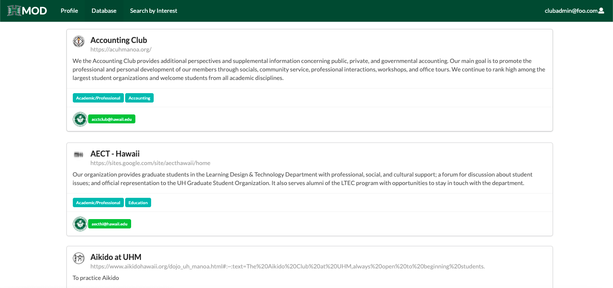
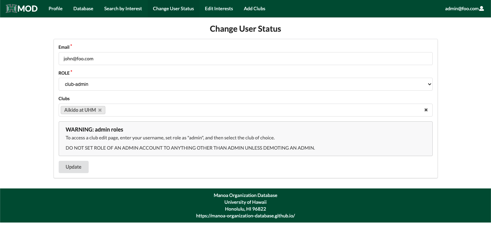
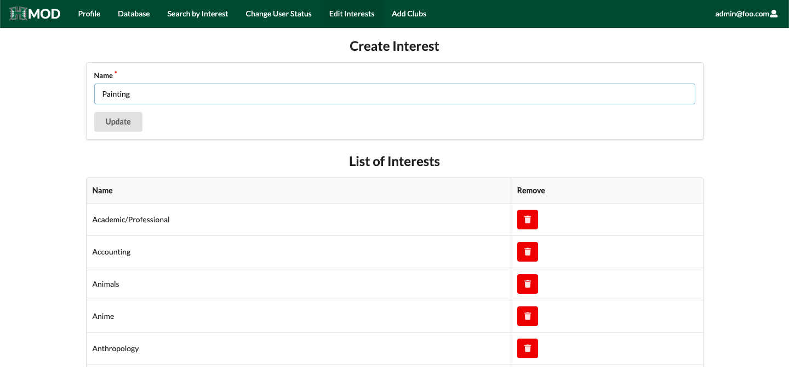

<h2>Purpose and Overview</h2>

  <figure class="figure w-20 float-start m-2">
    
  </figure>
  
The purpose of this project was to create a "one-stop-shop" directory for the vast number of clubs and organizations active on the University of Hawaii: Manoa campus. A student would log into the database using their unique school ID, then be able to browse the catalog of organizations, either from accessing the full list or filtering by interest. Clubs would be mutable by specific students denoted as "club-admins", and staff (or anyone else with administrator privileges) would not only be able to edit any club information but also to change students' privileges (regular user or club-admin).

<h2>My contributions</h2>
I was responsible primarily for creating the "Database, Change User Status, and Edit Interests" pages (the latter of which are only accessible to those with administrator privileges) and any components/methods they would need to run. Like with any project, some little tasks, such as debugging or project maintenance, are shared with all members.

<h3>Database page</h3>

The "Database" page was designed to list all the clubs and organizations currently active within the system as slew of cards. These cards wold contain relevant club information such as a club logo, description, interests, homepage, and points of contact. These cards were implemented using a component ClubCard.jsx file which would then be ported into and created for each club loaded onto the page (this method was much more efficient, as the cards were used in other pages as well).

<h3>Change User Status page</h3>

The "Change User Status" page was designed to for administrators to be able to change the role of a designated user from 'user' (basic level), 'club-admin' (mid-level), and 'admin' (top level). Once valid information is received in the form, the data is then processed using a Meteor.method located in Methods.js that changes the role of the designated user and additionally sets that user as a club-admin, if that user has the appropriate credentials and a club(s) is provided.

<h3>Edit Interests page</h3>

The "Edit Interests" page was designed for administrators to view all the interests currently accessible for clubs and users to add to their profiles. In addition, this page also allows for the creation and deletion of these interests. In both cases, Meteor.method (from Methods.js) was implemented to process the data into MongoDB collections. In the case of the latter, deletion will cause a system-wide purge of any reference to that specific interests across all users and organizations.

<h2>Takeaways</h2>
In contrast to the majority of my prior computer science experience working individually, this project gave me valuable experience in working with a team. Usually, when working by yourself, all that needs to be considered is a hard deadline, usually given by an external party (such as a client or supervisor). However, with collaborative work, internal deadlines must be set to avoid the whole group from falling behind or lacking because of the failure or absence of any dependent files or functions. From my personal experience, I made many mistakes and was almost late on a couple of my internal deadlines due to underestimating the work needed for a specific task. I lost a couple nights of sleep correcting these mistakes, and I am now very eager not to repeat them. Also, consistent communication between group members is vital to avoid miscommunication and wasted effort. Oftentimes at scheduled team meetings, there would be checkups with each other on where we were at with our designated tasks, in which we would report our successes and stumbling blocks to the group. In turn, the rest of the team would take that in stride and accommodate if necessary.

As for more technical aspects, I learned how to register domain names and employ an online server to host our web application, as well as experience using online software hosting tools (Github). 

Overall, I am very grateful for my first experience in collaborative software development to be in a classroom setting, rather than a professional one. I was able to gain invaluable real-life experience working in a "professional" setting with a group of my peers (some of which I wasn't familiar with prior to the project, so that was realistic too!). Working towards a completed project with others and seeing the fruits of your labor at the finish line is immensely satisfying, and I am excited for what lies ahead.

<h2>Links</h2>
For more information, visit the [Manoa Organization Database homepage](https://manoa-organization-database.github.io/).

View the [Organization GitHub page](https://github.com/manoa-organization-database).

View the [source code](https://github.com/manoa-organization-database/manoa-organization-database).
