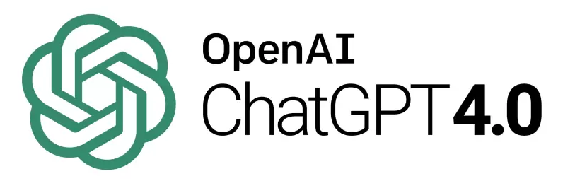

<h2>Project Overview</h2>

  <figure class="figure w-50 float-start">
    
  </figure>
  
The overall goal of this project was to convert raw optical character recognition text (OCR for short) obtained from a collection of receipts into JSON objects, from which analysis and data visualiation could be performed. The project can be roughly divided into three main sections: the development of the prompt generation code, the development of the classification and analysis code, and the visualization of the data. I was the lead on the first section of the project and supported my classmates on the other two sections.

<h3>Section I: Python Prompt Generation</h3>

  <figure class="figure w-20 float-start">
    
  </figure>

As stated above, the first section's main goal was to construct a Python program that would generate prompts to be used in ChatGPT 4.0. These prompts would guide ChatGPT 4.0 to convert raw OCR (optical character recognition) text which was scanned from a collection of receipts into JSON objects for easier analysis and storage. Upon receiving the JSON object of a given OCR text input, the program would save the JSON objects into a single file, with a single JSON object stored per line.

<h3>Section II: FAISS Classification and Analytics</h3>

  <figure class="figure w-20 float-end">
    
  </figure>

Afterwards, the second section would read in the newly created file with the output JSON objects and use the open-source FAISS (Facebook AI Similarity Search) library from Meta to implement a KNN search algorithm which would classify the items and vendors in receipts into categories such as "Food Products, Beverages, and Electronics" for items and "Grocery and Supermarkets, Restaurants and Supermarkets, and Health and Beauty" for vendors. Afterwards, the classified JSON objects were analyzed for summary statstics such as frequency, mean, and totals of items per category per vendor.

<h3>Section III: Data Visualization using Streamlit</h3>

  <figure class="figure w-30 float-start">
    
  </figure>

Lastly, the third section would visualize the information gained from the data analysis in the previous section. This visualization was constructed using Streamlit, an application framework that enables easier front-end development. The visualization interactable, allowing viewers to zoom in and out on certain charts, and is also equipped with annotations describing the different charts and their meanings. You can view the data visualization [here](https://receipt-classification-visualization.streamlit.app/).

<h2>My Contributions</h2>

  <figure class="figure w-20 float-start">
    
  </figure>

As previously mentioned, I was the lead on the first section of the project and had supporting roles on the other sections. As lead, I was in charge of constructing the majority of the Python code to construct the ChatGPT 4.0 prompts. To this end, I used Pydantic, a data validation library for Python, to validate the data to be in the proper format. Pydantic base models were used to formulate a generic idea of what the JSON object should look like, and the information from these models would be used to create format instructions which were fed into ChatGPT. Additionally, once ChatGPT finished generating a JSON object, the output would be piped into a Pydantic validator object which would ensure that any mistakes in data conversion from ChatGPT were fixed, after which the JSON object would be printed into the output file.

<h2>Personal Conclusions</h2>
This project was initially very challenging as it was the first time I've utilized the OpenAI, Pydantic, FAISS, and Streamlit libraries. However, I believe the challenge was well worth it as it provided me with experience in handling projects completely foreign to me as well as learning as I continue developing. Additionally, this project allowed me more experience in projects in a professional group setting, specifically those with more than three people. Adapting to different communication styles, scheduling meetings, and learning how to approach delegated work (and when to ask for help) were just some of the valuable organizational and interpersonal skills I was able to further develop during this time.

<h2>Links</h2>
View the data visualization [here](https://receipt-classification-visualization.streamlit.app/).

View the [Organization GitHub page](https://github.com/manoa-organization-database).

View the parse, conversion, and classification [source code](https://github.com/RecieptsParse/OCR_TO_JSON).

View the visualization [source code](https://github.com/RecieptsParse/visualization).
