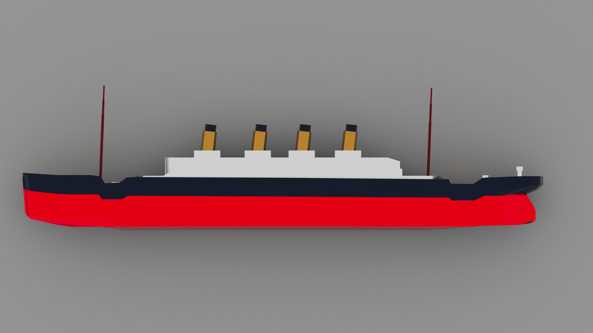
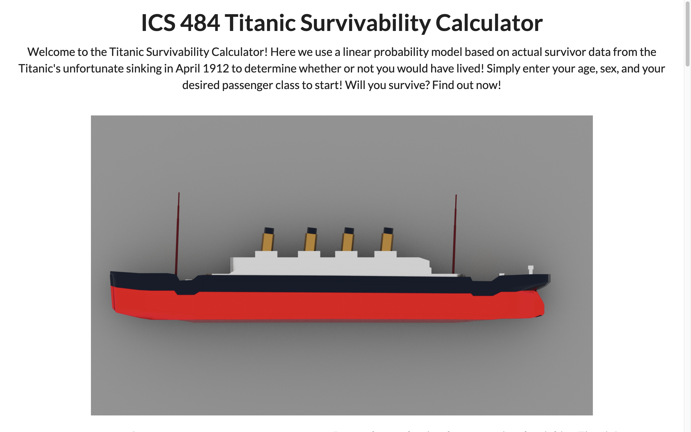
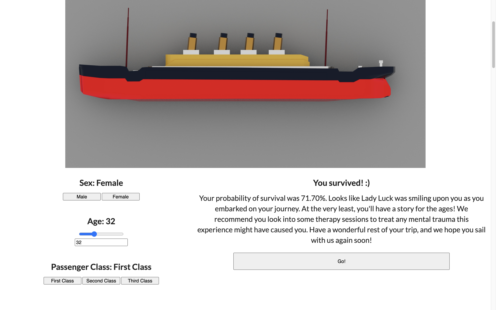

<h2>Purpose and Overview</h2>

  
The purpose of this project was to create a data visualization that would "tell the story" of the dataset it was built on. For our group, we chose to use the Titanic survival dataset as the basis of our project. We planned to build a simple website that would contain basic statistics from the data set as well as a linear probability model (LPM) that would calculate an individual's survival rate based on sex, age, and passenger class. A LPM is a tool used in data science to predict the probability of an event happening based on select parameter values. Like all other data science models, it is trained on previous data before being generalized.

<h2>My contributions</h2>
I was primarily responsible for building the website and ensuring the overall cohesiveness of the presentation. My other members were tasked with building the LPM, the image models of the Titanic ship, and the basic statistic charts. However, due to external circumstances, I also became responsible for building the LPM.

<h3>Linear Probability Model</h3>

  
The bulk of my responsibility was website building and cohesiveness. As such, most of my work of website formatting was done in HTML and CSS. As my team members were mainly working in Javascript, it was fairly easy to incorporate the statistics charts into the page. When the LPM was ready, I also constructed the dynamic inputs for the calculator and ensured it was usable multiple times. To accomplish this, I learned about and implemented data attributes in many of my HTML elements. This allowed me to pass information from JavaScript functions through the DOM and into other programs.

<h3>Linear Probability Model</h3>

As mentioned earlier, I took over the LPM portion of the project, which was previously being built in R. Since the model was already built and cross-validated, all that was left was that the LPM be implemented into the website. However, because I was not knowledgable with integrating R code into HTML websites, I opted to import the parameter weights of the model instead and hard-code the equation in JavaScript. While not an optimal solution, we were in a time crunch due to the external circumstances preventing work, so I adapted to the situation with what I knew.

<h2>Takeaways</h2>
For me, this project was an exercise in website development and adaptability. This project let me brush up on my HTML while discovering new facets of web design, such as the data attribute, that helped broaden my skill set with integrating back-end programs with front-end user experience. I also gained more experience in using GitHub to host and modify webpages.

However, while none of the individual technical elements were particularly difficult, the collaboration aspect, specifically when one or more members are absent for a given time, was quite challenging. The fact that I had to finalize the LPM when our team member became ill forced me to become adaptable to the situation at hand. To mitigate the problem, I had to think of unorthodox solutions, such as hard-coding the LPM from R to JavaScript and adapting the LPM inputs to work through JavaScript.

<h2>Links</h2>
Try out the calculator [here](https://jeremiahkady.github.io/484_final_project/).

The open-source Titanic survivor dataset can be found [here](https://data.world/nrippner/titanic-disaster-dataset).

View the [source code](https://github.com/jeremiahkady/484_final_project).
